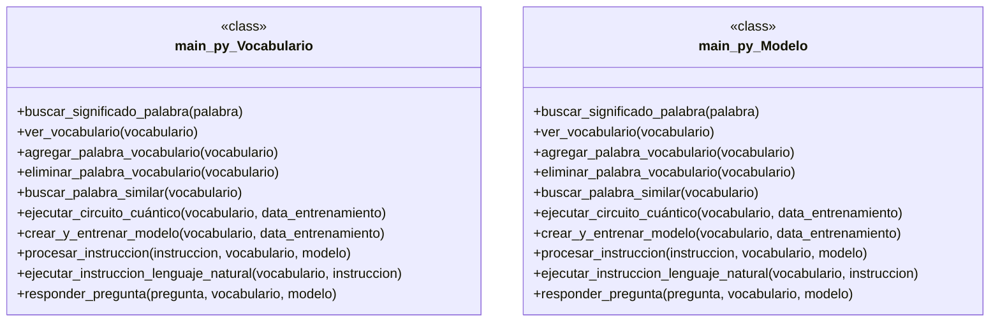

# Polyglot Codebase Knowledge Graph

> Generated offline by **readmenator**. 1 files, 23 symbols, 8 imports. Supports C, C++, Python, Go, Rust, JS/TS, Java, C#, Shell, PHP, Dart, GDScript, Nim, ASM, Ruby, Swift, Kotlin, Scala, Lua, Elixir.
> No LLMs. No tokens. Pure static analysis. See more [here](https://github.com/grisuno/ReadMenator)

**Start here:** Statistics Dashboard for scope, God Nodes for blast radius, Architecture Reference for per-file API. Agents: prefer `readmenator-agent/INDEX.md` + `SYMBOLS.md`.

**Wiki:** prefer `readmenator-wiki/index.md` for progressive disclosure: one synthesis page per community, `connections.json` with EXTRACTED vs INFERRED confidence, `queries.md` log, `REPORT.md` audit.

**Confidence:** EXTRACTED = parsed from source, INFERRED = heuristic bridge, AMBIGUOUS = reported, never hidden. See `readmenator-wiki/REPORT.md`.

**Total Files Parsed:** 1 | **Total Symbols Extracted:** 23 | **Total Imports:** 8

<!-- ranking_model: v1.0 | weights: {ppr:0.45,auth:0.2,test:0.15,doc:0.1,fresh:0.1} | alpha:0.85 | commit:1e0fd0b | date:2026-07-18 -->


## Table of Contents

1. [Statistics Dashboard](#statistics-dashboard)
2. [Architectural Layers](#architectural-layers)
3. [Ranked Context](#ranked-context)
4. [God Nodes](#god-nodes)
5. [Suggested Questions](#suggested-questions)
6. [Taint Propagation Map](#taint-propagation-map)
7. [Hotspot Analysis](#hotspot-analysis)
8. [Change Impact Analysis](#change-impact-analysis)
9. [Suggested Linting Rules](#suggested-linting-rules)
10. [Orphans](#orphans)
11. [Query Recipes](#query-recipes)
12. [Structural Knowledge Map](#structural-knowledge-map)
13. [UML Class Diagram](#uml-class-diagram)
14. [Code Property Graph](#code-property-graph)
15. [Architecture Reference](#architecture-reference)
    - [PY (1 files)](#py-1-files)

---

## Statistics Dashboard

| Metric | Value |
|--------|-------|
| Total Files | 1 |
| Total Symbols | 23 |
| Total Imports | 8 |
| Call Edges | 123 |
| Inheritance Edges | 0 |
| Languages | 1 |
| Avg Symbols/File | 23.0 |
| Avg Imports/File | 8.0 |

### Top Files by Import Count (Fan-Out)

| File | Imports | Symbols | Language |
|------|---------|---------|----------|
| `main.py` | 8 | 23 | py |

---

## Architectural Layers

Auto-detected from path patterns, naming conventions, and imported frameworks.

| Layer | Files |
|-------|-------|
| utility | 1 |

### utility

- `main.py` (py, 23 symbols)

---

## Ranked Context

Files ranked by composite score for the current query context. The ranking combines Personalized PageRank (query relevance), global authority, test coverage, documentation coverage, and code freshness. Model: v1.0.

| Rank | File | Composite | PPR | Authority | Test | Doc |
|------|------|-----------|-----|-----------|------|-----|
| 1 | `main.py` | 0.0000 | 0.0000 | 0.0000 | 0.00 | 0.00 |

---

## God Nodes

Most architecturally central files ranked by combined import/export degree and symbol richness.

| File | Score | Connections | PageRank |
|------|-------|-------------|----------|
| `main.py` | 2.3 | | 0.0000 |

---

## Suggested Questions

Auto-generated exploration prompts based on graph structure:

- What does main.py depend on, and what depends on it? (0 connections)
- What is Vocabulario in main.py and how is it used?
- What is the overall architecture of this codebase?

---

## Taint Propagation Map

Taint analysis traces how dangerous imports propagate through the codebase via transitive dependencies. Source files import dangerous modules directly; sink files receive the danger indirectly.

**Taint Sources:** 1 | **Taint Sinks:** 1 | **Propagation Paths:** 1

- `main.py` imports `requests` (0 hop to `main.py`) [medium]
  Path: main.py

---

## Hotspot Analysis

Files ranked by combined complexity (symbol count) and centrality (connection count). High-scoring files are architecturally critical and may need refactoring attention.

| File | Complexity | Centrality | Combined | Symbols | Connections |
|------|-----------|------------|----------|---------|-------------|
| `main.py` | 1.000 | 1.000 | 1.000 | 23 | 8 |

---

## Change Impact Analysis

Files sorted by how many other files would be affected if they changed. High-impact files should be changed with caution.

| File | Direct Dependents | Transitive Dependents | Total Impact |
|------|------------------|----------------------|--------------|
| `main.py` | 0 | 0 | 0 |

---

## Suggested Linting Rules

Automatically suggested linting and security rules based on patterns detected in the codebase. These can be exported as Semgrep rules using the `--export-rules` flag.

| Rule ID | Severity | Description | Language | Matches |
|---------|----------|-------------|----------|---------|
| `RM001` | info | Large number of functions in py: 21 total | py | 21 |
| `RM002` | info | Print statement found (consider logging instead) | python | 48 |

---

## Orphans

Files with no documentation or low connectivity. These are candidates for documentation investment or cleanup.

- `main.py` (23 symbols, no doc)

---

## Query Recipes

Example queries you can run against this knowledge base using the ranking engine:

```
# Find files most relevant to a concept
readmenator query "Where is the import resolver implemented?"

# Rank files by relevance to a topic
readmenator query "How does documentation generation work?"

# Explain why a file ranks highly
readmenator query "explain readmenator/_documentation.py"

# Trace dependency paths with ranked context
readmenator query "path from CLI to exporter"
```

The ranking model uses the following signals:

- **Personalized PageRank** (45% weight): query-specific relevance via seed propagation
- **Global Authority** (20% weight): structural importance via standard PageRank
- **Test Coverage** (15% weight): fraction of symbols referenced in test files
- **Doc Coverage** (10% weight): presence of docstrings and file-level docs
- **Freshness** (10% weight): recent modification activity

Results include score decomposition and justification paths for each ranked item.

---

## Structural Knowledge Map

```mermaid
graph TD
    classDef mod fill:#1e1e1e,stroke:#ff6666,stroke-width:2px,color:#fff;
    classDef cls fill:#2d2d2d,stroke:#4ec9b0,stroke-width:2px,color:#fff;
    classDef fn fill:#333,stroke:#dcdcaa,stroke-width:1px,color:#dcdcaa;
    classDef ext fill:#111,stroke:#666,stroke-dasharray: 5 5,color:#aaa;
    main_py["main.py (py)"]
    class main_py mod;
    main_py_Vocabulario["Vocabulario"]
    class main_py_Vocabulario cls;
    main_py --> main_py_Vocabulario
    main_py_Modelo["Modelo"]
    class main_py_Modelo cls;
    main_py --> main_py_Modelo
    main_py_buscar_significado_palabra["buscar_significado_palabra"]
    class main_py_buscar_significado_palabra fn;
    main_py --> main_py_buscar_significado_palabra
    main_py_ver_vocabulario["ver_vocabulario"]
    class main_py_ver_vocabulario fn;
    main_py --> main_py_ver_vocabulario
    main_py_agregar_palabra_vocabulario["agregar_palabra_vocabulario"]
    class main_py_agregar_palabra_vocabulario fn;
    main_py --> main_py_agregar_palabra_vocabulario
    ext_nltk["nltk"]
    class ext_nltk ext;
    main_py -.->|imports| ext_nltk
    ext_transformers["transformers"]
    class ext_transformers ext;
    main_py -.->|imports| ext_transformers
    ext_qiskit["qiskit"]
    class ext_qiskit ext;
    main_py -.->|imports| ext_qiskit
    ext_json["json"]
    class ext_json ext;
    main_py -.->|imports| ext_json
    ext_os["os"]
    class ext_os ext;
    main_py -.->|imports| ext_os
    ext_requests["requests"]
    class ext_requests ext;
    main_py -.->|imports| ext_requests
    ext_gensim_models["gensim.models"]
    class ext_gensim_models ext;
    main_py -.->|imports| ext_gensim_models
    ext_torch["torch"]
    class ext_torch ext;
    main_py -.->|imports| ext_torch
```



---

## UML Class Diagram

Auto-generated Mermaid class diagram from parsed class-level symbols. Shows classes, structs, interfaces, traits, and their methods with inheritance and dependency relationships.



---

## Code Property Graph

Machine-readable Code Property Graph (CPG) in JSON-LD format. This block allows AI agents to parse the full structural graph without additional file reads. Compatible with GraphRAG pipelines.

```json
{"@context": "https://schema.org", "analysis": {"communities": [], "god_nodes": [{"node_id": "main.py", "score": 2.3}], "surprising_connections": []}, "edges": [{"confidence": "EXTRACTED", "relation": "imports", "source": "main.py", "target": "nltk"}, {"confidence": "EXTRACTED", "relation": "imports", "source": "main.py", "target": "transformers"}, {"confidence": "EXTRACTED", "relation": "imports", "source": "main.py", "target": "qiskit"}, {"confidence": "EXTRACTED", "relation": "imports", "source": "main.py", "target": "json"}, {"confidence": "EXTRACTED", "relation": "imports", "source": "main.py", "target": "os"}, {"confidence": "EXTRACTED", "relation": "imports", "source": "main.py", "target": "requests"}, {"confidence": "EXTRACTED", "relation": "imports", "source": "main.py", "target": "gensim.models"}, {"confidence": "EXTRACTED", "relation": "imports", "source": "main.py", "target": "torch"}], "generator": "readmenator", "metadata": {"edge_count": 131, "file_count": 1, "language_count": 1, "symbol_count": 23}, "nodes": [{"id": "main.py", "kind": "module", "label": "main.py", "language": "py", "sha256": "2d4fe4054d79fa28", "symbol_count": 23, "symbols": [{"kind": "class", "line": 14, "name": "Vocabulario", "signature": "class Vocabulario"}, {"kind": "class", "line": 47, "name": "Modelo", "signature": "class Modelo"}, {"kind": "method", "line": 60, "name": "buscar_significado_palabra", "signature": "def buscar_significado_palabra(palabra)"}, {"kind": "method", "line": 78, "name": "ver_vocabulario", "signature": "def ver_vocabulario(vocabulario)"}, {"kind": "method", "line": 83, "name": "agregar_palabra_vocabulario", "signature": "def agregar_palabra_vocabulario(vocabulario)"}, {"kind": "method", "line": 88, "name": "eliminar_palabra_vocabulario", "signature": "def eliminar_palabra_vocabulario(vocabulario)"}, {"kind": "method", "line": 92, "name": "buscar_palabra_similar", "signature": "def buscar_palabra_similar(vocabulario)"}, {"kind": "method", "line": 100, "name": "ejecutar_circuito_cuántico", "signature": "def ejecutar_circuito_cuántico(vocabulario, data_entrenamiento)"}, {"kind": "method", "line": 133, "name": "crear_y_entrenar_modelo", "signature": "def crear_y_entrenar_modelo(vocabulario, data_entrenamiento)"}, {"kind": "method", "line": 138, "name": "procesar_instruccion", "signature": "def procesar_instruccion(instruccion, vocabulario, modelo)"}, {"kind": "method", "line": 170, "name": "ejecutar_instruccion_lenguaje_natural", "signature": "def ejecutar_instruccion_lenguaje_natural(vocabulario, instruccion)"}, {"kind": "method", "line": 179, "name": "responder_pregunta", "signature": "def responder_pregunta(pregunta, vocabulario, modelo)"}, {"kind": "method", "line": 197, "name": "generar_texto", "signature": "def generar_texto(topic, vocabulario, modelo)"}, {"kind": "method", "line": 239, "name": "interactuar_con_usuario", "signature": "def interactuar_con_usuario(vocabulario, data_entrenamiento)"}, {"kind": "method", "line": 15, "name": "__init__", "signature": "def __init__(self, data)"}, {"kind": "method", "line": 18, "name": "cargar_vocabulario", "signature": "def cargar_vocabulario(self)"}, {"kind": "method", "line": 26, "name": "agregar_palabra", "signature": "def agregar_palabra(self, palabra, significado)"}, {"kind": "method", "line": 30, "name": "eliminar_palabra", "signature": "def eliminar_palabra(self, palabra)"}, {"kind": "method", "line": 35, "name": "guardar_vocabulario", "signature": "def guardar_vocabulario(self)"}, {"kind": "method", "line": 42, "name": "transformar_a_modelo", "signature": "def transformar_a_modelo(self)"}, {"kind": "method", "line": 48, "name": "__init__", "signature": "def __init__(self, vocabulario)"}, {"kind": "method", "line": 52, "name": "transformar_vocabulario_a_modelo", "signature": "def transformar_vocabulario_a_modelo(self)"}, {"kind": "method", "line": 56, "name": "entrenar_modelo", "signature": "def entrenar_modelo(self, data_entrenamiento)"}]}], "type": "CodePropertyGraph", "version": "1.0"}
```

---

## Architecture Reference

### PY (1 files)

#### `main.py`
**Path:** `main.py`

**Classes:**
- `Vocabulario` (line 14) `class Vocabulario`
- `Modelo` (line 47) `class Modelo`

**Methods:**
- `buscar_significado_palabra` (line 60) `def buscar_significado_palabra(palabra)`
- `ver_vocabulario` (line 78) `def ver_vocabulario(vocabulario)`
- `agregar_palabra_vocabulario` (line 83) `def agregar_palabra_vocabulario(vocabulario)`
- `eliminar_palabra_vocabulario` (line 88) `def eliminar_palabra_vocabulario(vocabulario)`
- `buscar_palabra_similar` (line 92) `def buscar_palabra_similar(vocabulario)`
- `ejecutar_circuito_cuántico` (line 100) `def ejecutar_circuito_cuántico(vocabulario, data_entrenamiento)`
- `crear_y_entrenar_modelo` (line 133) `def crear_y_entrenar_modelo(vocabulario, data_entrenamiento)`
- `procesar_instruccion` (line 138) `def procesar_instruccion(instruccion, vocabulario, modelo)`
- `ejecutar_instruccion_lenguaje_natural` (line 170) `def ejecutar_instruccion_lenguaje_natural(vocabulario, instruccion)`
- `responder_pregunta` (line 179) `def responder_pregunta(pregunta, vocabulario, modelo)`
- `generar_texto` (line 197) `def generar_texto(topic, vocabulario, modelo)`
- `interactuar_con_usuario` (line 239) `def interactuar_con_usuario(vocabulario, data_entrenamiento)`
- `__init__` (line 15) `def __init__(self, data)`
- `cargar_vocabulario` (line 18) `def cargar_vocabulario(self)`
- `agregar_palabra` (line 26) `def agregar_palabra(self, palabra, significado)`
- `eliminar_palabra` (line 30) `def eliminar_palabra(self, palabra)`
- `guardar_vocabulario` (line 35) `def guardar_vocabulario(self)`
- `transformar_a_modelo` (line 42) `def transformar_a_modelo(self)`
- `__init__` (line 48) `def __init__(self, vocabulario)`
- `transformar_vocabulario_a_modelo` (line 52) `def transformar_vocabulario_a_modelo(self)`
- `entrenar_modelo` (line 56) `def entrenar_modelo(self, data_entrenamiento)`
