# Polyglot Codebase Knowledge Graph

> Generated offline by **readmenator**. Supports C, C++, Python, Go, Rust, JS/TS, Java, C#, Shell, PHP, Dart, GDScript, Nim, ASM.
> No LLMs. No tokens. Pure static analysis.

**Total Files Parsed:** 1 | **Total Symbols Extracted:** 23 | **Total Imports:** 8

## Structural Knowledge Map

```mermaid
graph TD
    classDef mod fill:#1e1e1e,stroke:#ff6666,stroke-width:2px,color:#fff;
    classDef cls fill:#2d2d2d,stroke:#4ec9b0,stroke-width:2px,color:#fff;
    classDef fn fill:#333,stroke:#dcdcaa,stroke-width:1px,color:#dcdcaa;
    classDef ext fill:#111,stroke:#666,stroke-dasharray: 5 5,color:#aaa;
    main_py["main.py (py)"]
    class main_py mod;
    main_py_Vocabulario["Vocabulario"]
    class main_py_Vocabulario cls;
    main_py --> main_py_Vocabulario
    main_py_Modelo["Modelo"]
    class main_py_Modelo cls;
    main_py --> main_py_Modelo
    main_py_buscar_significado_palabra["buscar_significado_palabra"]
    class main_py_buscar_significado_palabra fn;
    main_py --> main_py_buscar_significado_palabra
    main_py_ver_vocabulario["ver_vocabulario"]
    class main_py_ver_vocabulario fn;
    main_py --> main_py_ver_vocabulario
    main_py_agregar_palabra_vocabulario["agregar_palabra_vocabulario"]
    class main_py_agregar_palabra_vocabulario fn;
    main_py --> main_py_agregar_palabra_vocabulario
    ext_nltk["nltk"]
    class ext_nltk ext;
    main_py -.->|imports| ext_nltk
    ext_transformers["transformers"]
    class ext_transformers ext;
    main_py -.->|imports| ext_transformers
    ext_qiskit["qiskit"]
    class ext_qiskit ext;
    main_py -.->|imports| ext_qiskit
    ext_json["json"]
    class ext_json ext;
    main_py -.->|imports| ext_json
    ext_os["os"]
    class ext_os ext;
    main_py -.->|imports| ext_os
    ext_requests["requests"]
    class ext_requests ext;
    main_py -.->|imports| ext_requests
    ext_gensim_models["gensim.models"]
    class ext_gensim_models ext;
    main_py -.->|imports| ext_gensim_models
    ext_torch["torch"]
    class ext_torch ext;
    main_py -.->|imports| ext_torch
```

---

## Architecture Reference

### PY (1 files)

#### `main.py`
**Path:** `main.py`

**Classs:**
- `Vocabulario` (line 14)
- `Modelo` (line 47)

**Functions:**
- `buscar_significado_palabra` (line 60)
- `ver_vocabulario` (line 78)
- `agregar_palabra_vocabulario` (line 83)
- `eliminar_palabra_vocabulario` (line 88)
- `buscar_palabra_similar` (line 92)
- `ejecutar_circuito_cuántico` (line 100)
- `crear_y_entrenar_modelo` (line 133)
- `procesar_instruccion` (line 138)
- `ejecutar_instruccion_lenguaje_natural` (line 170)
- `responder_pregunta` (line 179)
- `generar_texto` (line 197)
- `interactuar_con_usuario` (line 239)
- `__init__` (line 15)
- `cargar_vocabulario` (line 18)
- `agregar_palabra` (line 26)
- `eliminar_palabra` (line 30)
- `guardar_vocabulario` (line 35)
- `transformar_a_modelo` (line 42)
- `__init__` (line 48)
- `transformar_vocabulario_a_modelo` (line 52)
- `entrenar_modelo` (line 56)
